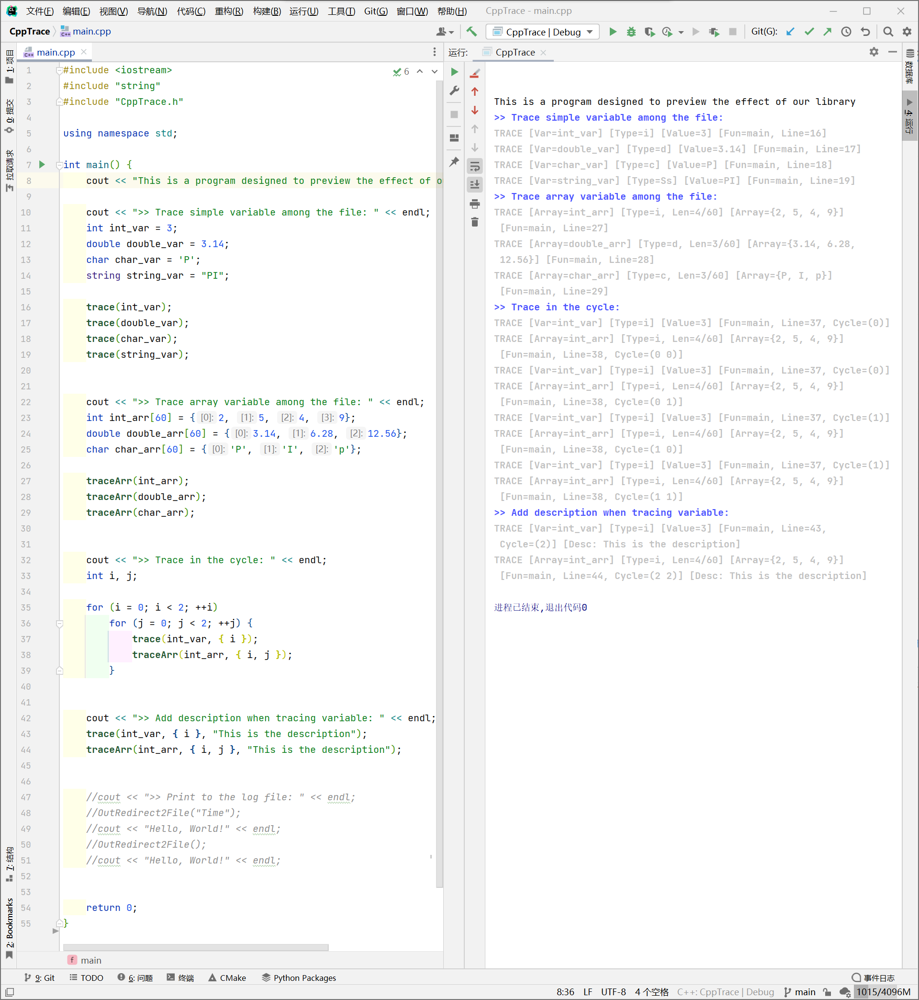

# CppTrace

[English Readme](https://github.com/Fentaniao/CppTrace/blob/main/README.md) · [中文文档](https://github.com/Fentaniao/CppTrace/blob/main/README_zh.md)

A logging library to trace C++ variables.

## Features

- Trace simple variable among the file.
- Trace array variable among the file.
- Trace variable in the cycle.
- Add description with variable.
- Information including variable name, variable type, value, function container, the line of the trace code, cycle number, and the description.

### Screenshot



## Install

[GitHub releases page](https://github.com/Fentaniao/CppTrace/releases), click on `Assets` at the bottom to show the files available in the release and then click on the head file you want to download. Finally, include the head file in your project.

## Usage

The library now has two main functions:

```
trace(varName, [a list including cycle variables], [a string of the description])
traceArr(varName, [a list including cycle variables], [a string of the description])
```

First include the head file in your project by `#include "CppTrace.h"`, and then call the two function in the program, it can print the variable's information to command window, including variable name, variable type, value, function container, the line of the trace code, cycle number, and the description.

## Todo

- Support function that can print to file
- Provide API for develop secondary easier

## Contact

Author: Fentaniao

Email: [Fentaniao@gmail.com](mailto:Fentaniao@gmail.com)

## License

[GPL-3.0 License](https://github.com/Fentaniao/CppTrace/blob/main/LICENSE) © Fentaniao
