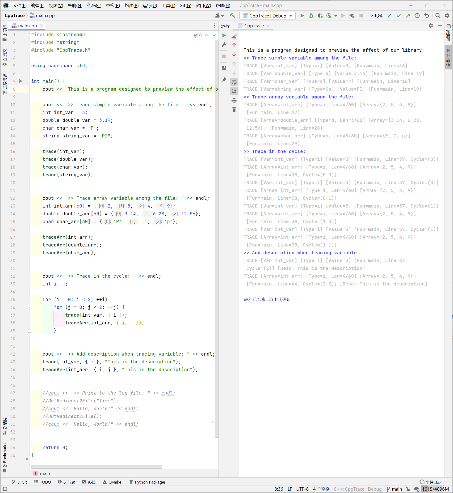

# CppTrace

[English Readme](https://github.com/Fentaniao/CppTrace/blob/main/README.md) · [中文文档](https://github.com/Fentaniao/CppTrace/blob/main/README_zh.md)

一个用于跟踪 C++ 变量的日志库。

## 特征

- 在文件中跟踪简单变量.
- 在文件中跟踪数组变量。
- 在循环中跟踪变量。
- 为变量添加描述。
- 可获得的信息包括变量名称、变量类型、变量的值、所在函数、所在的行、当前的循环重数和描述。

### 屏幕截图



## 安装

导航到[GitHub 发布页面](https://github.com/Fentaniao/CppTrace/releases)，单击底部的 `Assets` 以显示发行版中可用的文件，然后单击要下载的头文件。

最后，在您的项目中包含下载的头文件。

## 用法

这个库现在有两个主要功能：

```
trace(varName, [a list including cycle variables], [a string of the description])
traceArr(varName, [a list including cycle variables], [a string of the description])
```

首先通过 `#include "CppTrace.h"`在您的项目中包含库文件，然后在您的程序中调用这两个函数，它可以将变量的信息打印到命令窗口中，包括变量名称、变量类型、变量的值、所在函数、所在的行、所在的循环重数和描述。

## 待办事项

- 支持打印到文件的功能
- 为二次开发提供 API 

## 联系

作者：Fentaniao

邮箱：[Fentaniao@gmail.com](mailto:Fentaniao@gmail.com)

## 开源许可证

[GPL-3.0 License](https://github.com/Fentaniao/MATLABUtilities/blob/main/LICENSE) © Fentaniao
